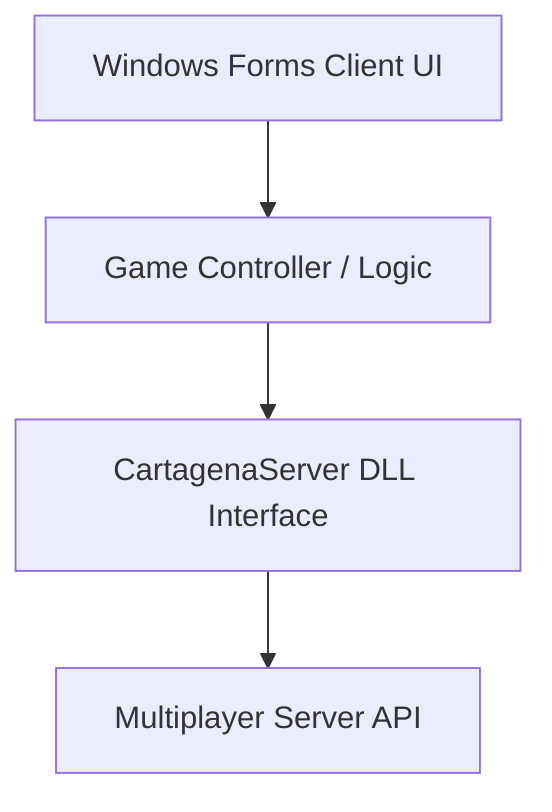

# Game Cartagena PI3

[](https://learn.microsoft.com/en-us/dotnet/csharp/)

## Table of Contents

- [Context](#-context)
- [Software features](#-software-features)
- [Technologies and tools](#-technologies-and-tools)
- [Architecture](#-architecture)
- [Repository structure](#-repository-structure)
- [Requirements](#-requirements)
- [How to run](#-how-to-run)
- [Author](#-author)

# 📌 Context

This is a multiplayer board game project modeled after "Cartagena", developed and studied using C# Windows Forms. Created to consolidate practical knowledge in C# development, networking, and Windows Forms UI.

## 🚀 Software features

- **Base Structure Configured:** Standard C# desktop solution.
- **Modular UI Forms:** Separated screens for Game Lobby, Join Game, Match Creation, Players List, and Main Game Board.
- **Local Game Server Integration:** Uses `CartagenaServer.dll` to orchestrate turns, player registration, cards distribution, and game state.

## 🛠️ Technologies and tools

- C# (.NET Core / .NET Framework)
- Windows Forms (UI)
- External Game Engine Library (`CartagenaServer.dll`)

## 📋 Architecture



## 📂 Repository structure

```text
- 📂 game-cartagena-pi3/
  - 📄 CartagenaServer.dll (Game engine dynamic library)
  - 📄 CartagenaServer.xml (Library documentation)
  - 📄 pi.zip
  - 📄 PI3_Cartagena.sln (Solution file)
  - 📂 PI3_Cartagena/ (Project source code)
    - 📄 App.config
    - 📄 PI3_Cartagena.csproj
    - 📄 Program.cs (Main entry point)
    - 📄 Tela_Criacao_Inicio_Reserva.cs
    - 📄 Tela_CriarPartida.cs
    - 📄 Tela_Inicial.cs (Main dashboard/lobby screen)
    - 📄 Tela_Jogadores.cs
    - 📄 Tela_jogo.cs (Main gameplay board)
    - 📄 Tela_Partida.cs
```

## 📦 Requirements

- .NET SDK 6.0+ or .NET Framework development tools
- Visual Studio 2022 or VS Code with C# Dev Kit

## ⚙️ How to run

### 1. Clone the Repository
Clone the repository to your local machine:
```bash
git clone https://github.com/MatheusRodri/game-cartagena-pi3.git
cd game-cartagena-pi3
```

### 2. Restore NuGet Packages
Restore NuGet dependencies using CLI:
```bash
dotnet restore
```

### 3. Build and Run
Open the solution file `PI3_Cartagena.sln` in **Visual Studio** and press **F5** to build and run the application.
Alternatively, use the command line:
```bash
dotnet run --project PI3_Cartagena
```

## 👤 Author

Matheus Rodrigues 
[LinkedIn](https://linkedin.com/in/matheus-rodrigues-mrj) [GitHub](https://github.com/MatheusRodri)
